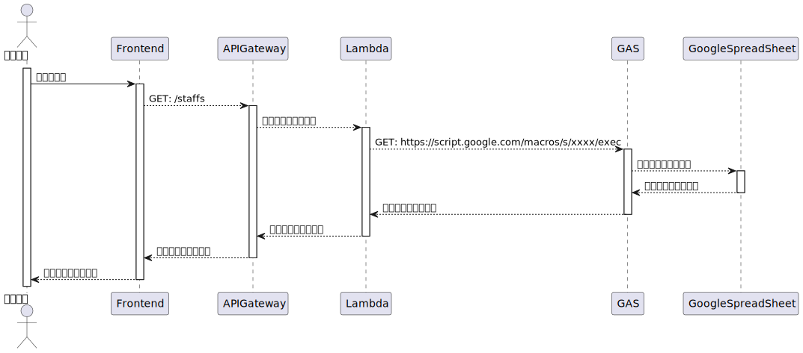

# 職員情報の取得

職員情報は Google Spreadsheet で管理する。

## 利点

- 職員情報を DB で管理する必要がなくなる
- 既存のスプレッドシートを再利用することができる

Google Calendar の職員名が、電子カルテサービスの名前と異なる（例：〇〇リーダー 名前） 
そのため既存の実装ではスプレッドシートに職員名を記入し、 
Google カレンダーのユーザー名のカラムを記載した職員名に置き換えるようにしている
