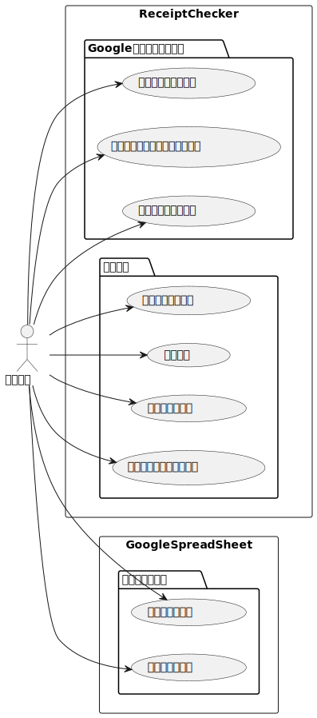

# 機能一覧（照合）

| No  | 機能名         | 機能概要                                                                       |
| --- | -------------- | ------------------------------------------------------------------------------ |
| 1   | 認証           | Cognito のユーザープールを利用したユーザーと認証の管理を行う                   |
| 2   | 認可           | 施設毎にグループを作成し、データへのアクセス権を制御する                       |
| 3   | 照合           | 実訪問データ（CSV 形式で出力したファイル）を受け取り、サーバー側で照合を行う。 |
| 4   | 照合結果表示   | （3） でサーバーから返された照合データをクライアントで表示する                 |
| 5   | 予定情報の設定 | Google カレンダーから取得する情報の設定を行う（月日・スタッフ・カレンダー）    |
| 6   | 照合結果保存   | 照合内容を CSV 形式のファイルとして保存する                                    |
| 7   | ユーザー登録   | Cognito のユーザープールに新しくユーザーを登録する                             |

# ユースケース

