# 画面一覧

| 画面 No | 画面名                 | Path      |
| ------- | ---------------------- | --------- |
| 1       | ログイン               | /login    |
| 2       | 照合画面               | /home     |
| 3       | （予定・職員）設定画面 | /settings |
| 4       | 照合結果画面           | /result   |

## 画面遷移図

